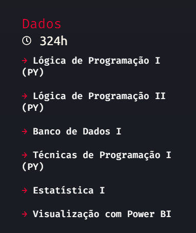

  

O <a href="https://ada.tech/sou-aluno/programas/ifood-vem-ser-tech" target="_blank">Vem Ser Tech - Dados</a> é um programa desenvolvido pela <a href="https://ada.tech/" target="_blank">Ada Tech</a> em parceria com o <a href="https://potenciatech.com.br/" target="_blank">Potência Tech</a>, projeto fundado pelo iFood que promove a inclusão e viabiliza a entrada de pessoas no mercado de tecnologia.

Esse repositório é dedicado ao meu aprendizado durante essa jornada na área de Dados. Nele você encontrará aulas, exercícios e projetos desenvolvidos durante o curso. Abaixo você também encontrará a trilha e a carga horaria que foi dedicada ao curso.

  

Como pode ver acima a trilha do curso é divida em seis módulos:

<ul>
  <li>[X] <a href="https://github.com/Math-Muniz/iFood-Adatech-Data-Bootcamp/tree/main/Modulo-01">Módulo 1: Lógica de Programação com Python I;</a></li>
  <li>[X] <a href="https://github.com/Math-Muniz/iFood-Adatech-Data-Bootcamp/tree/main/Modulo-02">Módulo 2: Lógica de Programação com Python II;</a></li>
  <li>[X] <a href="https://github.com/Math-Muniz/iFood-Adatech-Data-Bootcamp/tree/main/Modulo-03">Módulo 3: Banco de Dados I;</a></li>
  <li>[ ] <a href="https://github.com/Math-Muniz/iFood-Adatech-Data-Bootcamp/tree/main/Modulo-04">Módulo 4: Visualização com Power BI;</a></li>
  <li>[ ] <a href="https://github.com/Math-Muniz/iFood-Adatech-Data-Bootcamp/tree/main/Modulo-05">Módulo 5: Técnicas de Programação com Python I;</a></li>
  <li>[ ] <a href="https://github.com/Math-Muniz/iFood-Adatech-Data-Bootcamp/tree/main/Modulo-06">Módulo 6: Estatística I.</a></li>
  <li>[ ] <a href="https://github.com/Math-Muniz/iFood-Adatech-Data-Bootcamp/tree/main/Modulo-07">Módulo 7: Orientação de Carreira.</a></li>
</ul>

   
  
  
  

